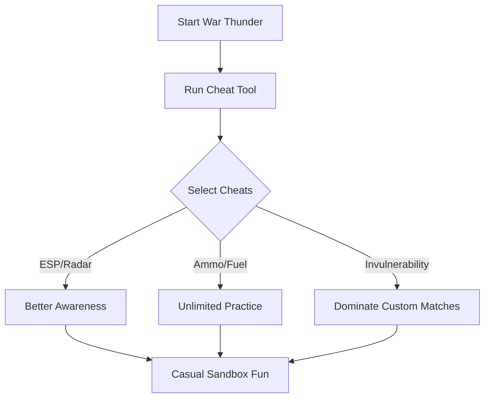

# War Thunder Cheat 🚀

The **War Thunder Cheat Tool** is designed for players who want expanded tactical awareness and smoother gameplay progression. With overlays, resource multipliers, and survival options, this tool helps you stay one step ahead in air, land, and sea battles without grinding endlessly.

It emphasizes **information and control**, letting you customize your War Thunder sessions for practice, testing, or solo fun.

---

## 📖 Overview

War Thunder delivers realistic, intense vehicle combat, but progression and resource farming can feel heavy. This cheat tool lightens the grind and gives you **ESP overlays, radar tracking, and configurable toggles** to improve awareness, accuracy, and efficiency.

[!WARNING]
This tool is recommended for **offline/custom sessions only**. Using it in competitive online battles risks permanent bans.

---

## 🛠 Features

* **ESP Overlay 👁** – Spot enemy vehicles, allies, and objectives.
* **Radar Hack** – See enemy planes and tanks across the map.
* **Infinite Ammo & Fuel** – Practice maneuvers without limits.
* **No Recoil / No Spread** – Stabilize weapon accuracy.
* **Resource Multipliers** – Faster unlocks and upgrade testing.
* **Invulnerability Toggle** – Survive explosions and crashes.
* **Custom Hotkeys** – Bind cheats to quick toggles F1–F8.

---

## 💻 Compatibility

| Platform       | Status         | Notes                           |
| -------------- | -------------- | ------------------------------- |
| Windows 10/11  | ✅ Full Support | Steam & Gaijin builds supported |
| Steam Deck     | ⚠️ Partial     | Proton tweaks required          |
| Linux (Proton) | ⚠️ Partial     | ESP colors may vary in overlays |
| Consoles       | ❌ Unsupported  | PC-only functionality           |

[!NOTE]
For stability, launch War Thunder first, then run the cheat tool as Administrator.

---

## ⚡ Setup Guide

1. **Download & extract** the cheat package.
2. Launch *War Thunder*.
3. Run `WarThunder_Cheat.exe` as Administrator.
4. Open overlay with the `Insert` key.
5. Toggle options with F1–F8 or via menu.

```ini
[CheatConfig]
ESP=F1
RadarHack=F2
InfiniteAmmo=F3
InfiniteFuel=F4
NoRecoil=F5
Invulnerability=F6
```

---

## 📊 Workflow Diagram



---

## ❓ FAQ

**Q: Can I use this online in PvP?**
A: Strongly discouraged—use in custom/offline modes only.

**Q: Does ESP work in air and ground battles?**
A: Yes, overlays highlight both aircraft and armored vehicles.

**Q: Will this affect my progression?**
A: Resource multipliers can speed up testing, but achievements may disable.

**Q: Is the cheat updated with patches?**
A: Yes, compatibility updates are released regularly.

**Q: Can I save custom configs?**
A: Yes, all hotkeys and multipliers are editable in the `.ini` file.

---

## 🎯 Final Thoughts

The **War Thunder Cheat Tool** is perfect for players who want to **train, experiment, or sandbox** without grind-heavy restrictions. With ESP, radar vision, and unlimited resources, it offers a new way to experience the game outside of competitive lobbies.
